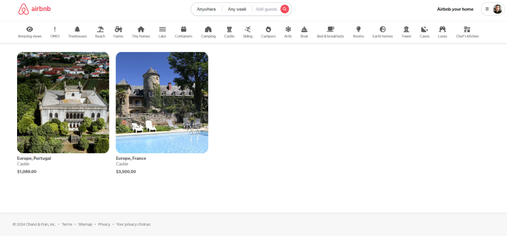
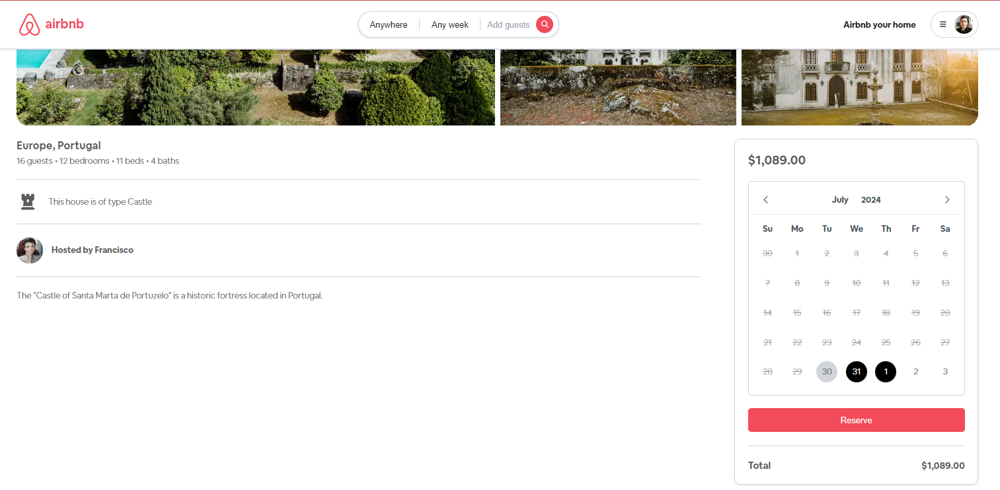
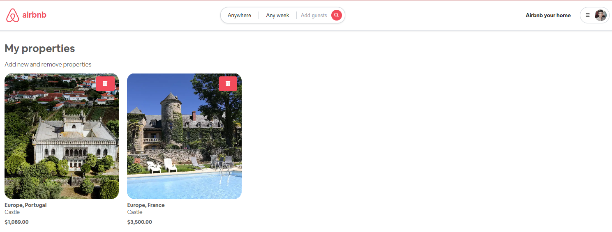
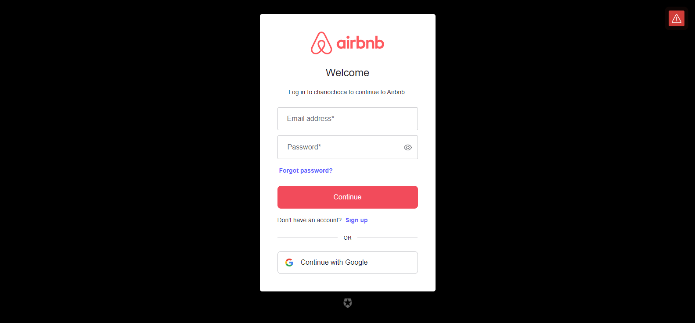
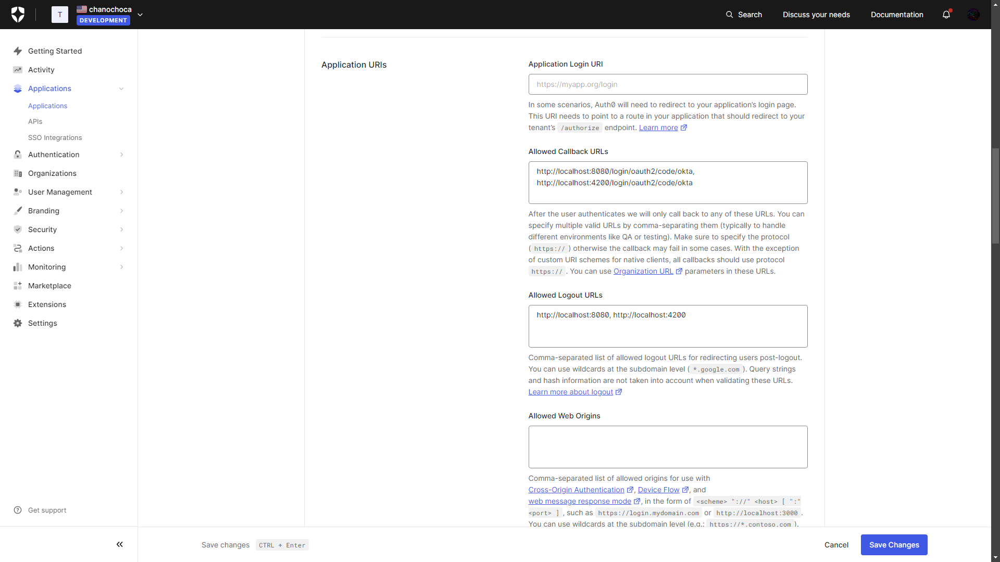
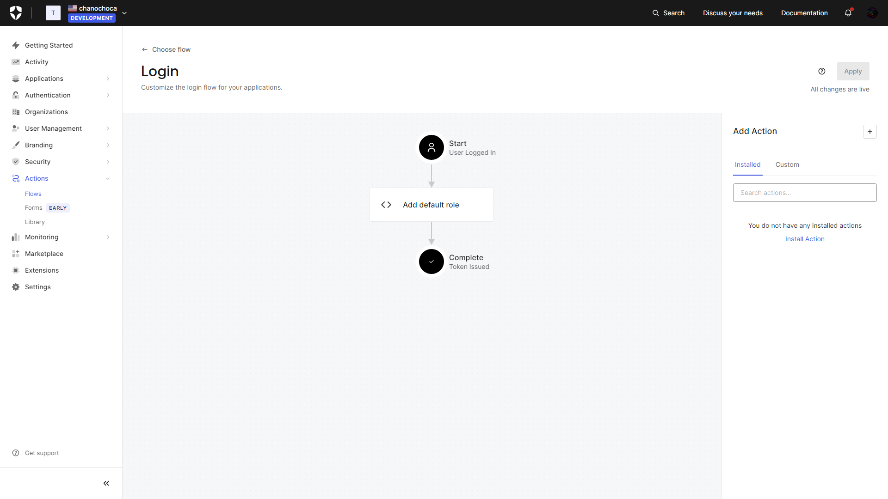
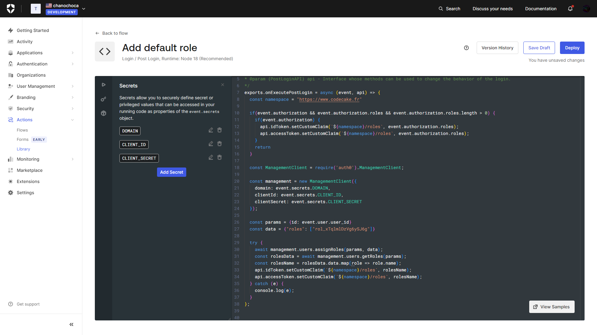
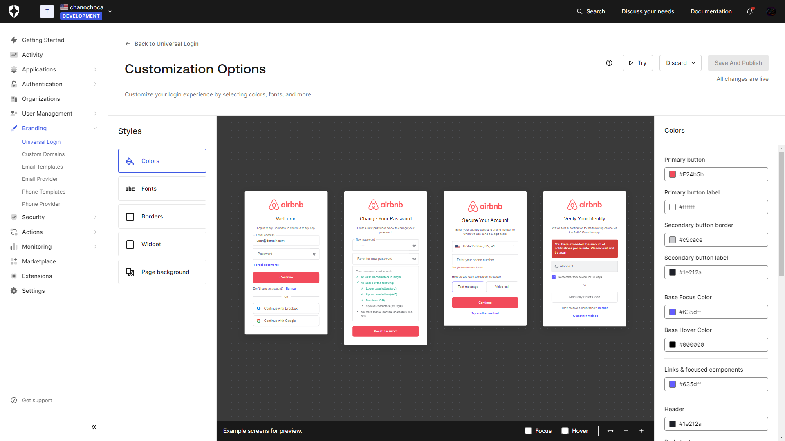
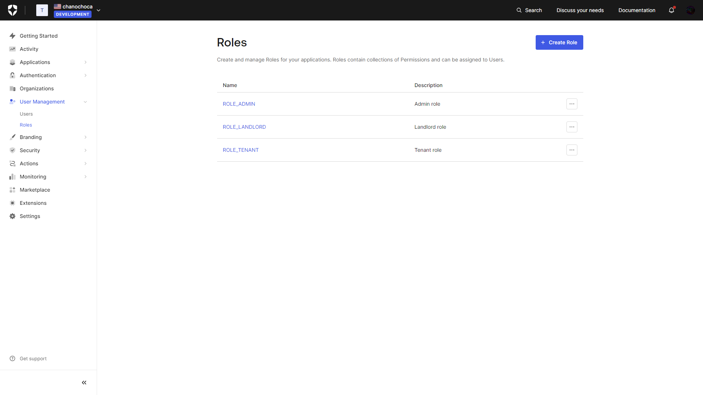

# Airbnb

This is a full stack project with Angular and Spring Boot (with Java 22 and Maven)

## Screenshots

Image of the index page

Image of booking details

You can also delete your properties as a tenant

The login page


## Auth0 Configuration: https://auth0.com/docs/quickstarts

The application must be created as a 'Regular Web Application', you also need to configure the following fields after creation:

Configure user management

The logic of logging, you need to create a role

The logging logic, in addition to the code seen on screen, needs to create variables in 'Secrets' and variables in 'Dependencies'
* Secrets
  * DOMAIN
  * CLIENT_ID
  * CLIENT_SECRET
*  Dependencies (under the Secrets icon)
  * auth0 (with latest version)


Style of logging

And roles



## Tools Used

- Day.js
- Leaflet
- PrimeNG
- Font Awesome


## Install

```bash
  npm install
```


## Run Application

```bash
  npm start
```

## Authors

- [@Juan Ignacio Caprioli (ChanoChoca)](https://github.com/ChanoChoca)
- [@Luis Francisco Martinez (Francisco9403)](https://github.com/Francisco9403)


## Badges

[//]: # (Add badges from somewhere like: [shields.io]&#40;https://shields.io/&#41;)

[](https://choosealicense.com/licenses/mit/)
[](https://opensource.org/licenses/)
[](http://www.gnu.org/licenses/agpl-3.0)
