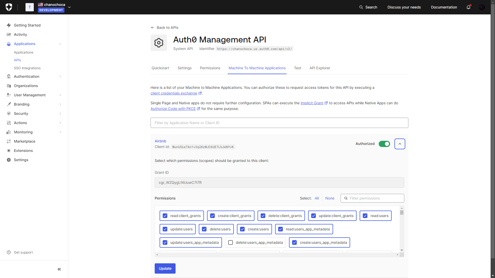

# Airbnb

This is a full stack project with Angular and Spring Boot (with Java 22 and Maven)

## Screenshots

Image of the index page

Image of booking details

You can also delete your properties as a tenant

The login page


## Auth0 Configuration: https://auth0.com/docs/quickstarts

The application must be created as a 'Regular Web Application', you also need to configure the following fields after creation:

Also in the same tab, in 'Allowed Origins (CORS)' fill in with `http://localhost:8080, http://localhost:4200`

Configure user management

The logic of logging, you need to create a role

The logging logic, in addition to the code seen on screen, needs to create variables in 'Secrets' and variables in 'Dependencies'
* Secrets
  * DOMAIN
  * CLIENT_ID
  * CLIENT_SECRET
*  Dependencies (under the Secrets icon)
   * auth0 (with latest version)
   

Style of logging

And roles


## Tools Used

- Spring Boot DevTools
- Spring Web
- Spring Security
- OAuth2 Client
- Okta
- Liquibase Migration
- PostgreSQL Driver
- Spring Data JPA
- Validation
- Docker Compose Support

## Configuration
Modify the `.yml` files with your configuration of DB and Auth0. 

Also modify `compose.yml` if you want to use docker-compose.

## Run Application

```bash
  mvn spring-boot:run
```
Or with docker-compose
```bash
docker-compose up -d
```

## Authors

- [@Juan Ignacio Caprioli (ChanoChoca)](https://github.com/ChanoChoca)
- [@Luis Francisco Martinez (Francisco9403)](https://github.com/Francisco9403)


## Badges

[//]: # (Add badges from somewhere like: [shields.io]&#40;https://shields.io/&#41;)

[](https://choosealicense.com/licenses/mit/)
[](https://opensource.org/licenses/)
[](http://www.gnu.org/licenses/agpl-3.0)
